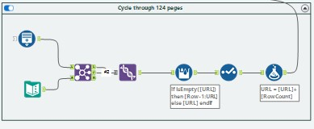
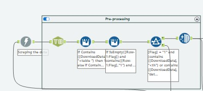
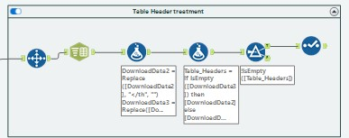
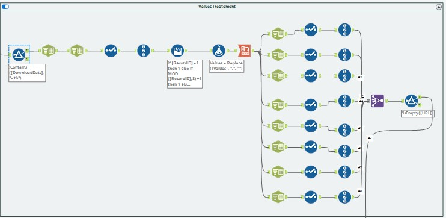

# US NASDAQ Stock Prices Web Scraping with Alteryx

This project is an Alteryx-based web scraping workflow that extracts US NASDAQ stock prices from CentralCharts. It captures data across 124 pages and performs data transformations to generate a structured dataset for analysis. The workflow is designed to handle various aspects of data extraction, cleaning, and export, using Alteryx's nodes and tools.

## Project Overview

- **Data Source**: [CentralCharts - US NASDAQ Stocks](https://www.centralcharts.com/en/price-list-ranking/ALL/asc/ts_19-us-nasdaq-stocks--qc_1-alphabetical-order?p=1)
- **Pages Scraped**: 124
- **Tools Used**: Alteryx Designer
- **Output**: A cleaned and structured CSV file (`Scraped_data.csv`) containing stock price data from the NASDAQ.

## Workflow Overview

The Alteryx workflow is divided into the following sections:

1. **Page Cycling and URL Generation**  
2. **PreProcessing**
3. **Table Headers Extraction**
4. **Values Treatment**
5. **Financial Instruments Treatment**

### Workflow Components

#### 1. Page Cycling and URL Generation

   - **Purpose**: This part of the workflow dynamically generates URLs for all 124 pages of stock data.
   - **Key Steps**:
     - The URL base template is concatenated with the page numbers, allowing the workflow to loop through each page.

#### 2. PreProcessing

   - **Purpose**: Extracts only the useful parts of the HTML code (The table tag).
   - **Key Steps**:
     - The workflow fetches HTML content for each page URL.
     - A series of conditions and filters check for the presence of relevant data in the downloaded HTML (e.g., tables and specific tags).
     - A flag is set when relevant data is found, which enables further processing in the next steps.

#### 3. Table Header Treatment

   - **Purpose**: Dynamic extraction of the table headers ( proof of concept ) but this part was not used, instead I edited the table headers with the select tool.
   - **Key Steps**:
     - Cleaning of the input data.
     - Dynamic extraction of the column headers.

#### 4. Values Treatment

   - **Purpose**: Cleans and standardizes extracted data values.
   - **Key Steps**:
     - Various parsing and transformation nodes format data columns to make them consistent.
     - Further cleaning steps to provide the expected outputs (eg: removing the thousands seperator, changing the column type..)

#### 5. Financial Instruments treament

   - **Purpose**: Extracts the stocks names seperately.
   - **Output**: A list of the stocks names to be joined with the values extracted and consolidate the final dataset.

## Example Output

| URL | Financial Instrument | Current Price | Change(%) | Open | High | Low | Volume | Cap. | Issued Cap. |
|-----|-----------------------|---------------|-----------|------|------|------|--------|------|-------------|
| [CentralCharts Page 79](https://www.centralcharts.com/en/price-list-ranking/ALL/asc/ts_19-us-nasdaq-stocks--qc_1-alphabetical-order?p=79) | NICE LTD ADS | 192.07 | +1.09% | 191.10 | 192.79 | 188.61 | 584178 | - | - |
| [CentralCharts Page 79](https://www.centralcharts.com/en/price-list-ranking/ALL/asc/ts_19-us-nasdaq-stocks--qc_1-alphabetical-order?p=79) | NIKOLA CORP. | 3.25 | +7.62% | 3.02 | 3.35 | 2.96 | 4728170 | - | - |
| [CentralCharts Page 79](https://www.centralcharts.com/en/price-list-ranking/ALL/asc/ts_19-us-nasdaq-stocks--qc_1-alphabetical-order?p=79) | NIOCORP DEVELOPMENTS | 1.46 | -0.68% | 1.53 | 1.53 | 1.46 | 134884 | - | - |
| [CentralCharts Page 79](https://www.centralcharts.com/en/price-list-ranking/ALL/asc/ts_19-us-nasdaq-stocks--qc_1-alphabetical-order?p=79) | NIP GROUP INC. ADS | 6.22 | -4.31% | 6.50 | 6.55 | 6.22 | 109694 | - | - |
| ... | ... | ... | ... | ... | ... | ... | ... | ... | ... |

## How to Run the Workflow

1. Open the workflow file in Alteryx Designer.
2. Ensure your environment has access to the internet to fetch data from the source URL.
3. Run the workflow, which will scrape data across 124 pages, clean it, and export the result to `your_output_path/Scraped_data.csv`.

## Future Improvements

- **Error Handling**: Implement error handling for network failures.
- **Automated Scheduling**: Schedule the workflow to run periodically for updated data.

## References

This project was inspired by the code and structure in the following GitHub repository:
- [Stock Web Scraper by bharding216](https://github.com/bharding216/stock-web-scraper/tree/main)
